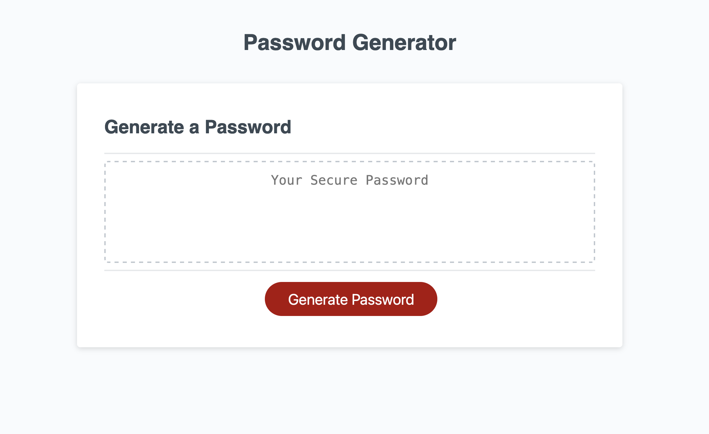

# Password Generator

## Description

This is an application that generates a random password based on the user's input.

## Installation

N/A

## Usage

[Demo URL](https://celiyo.github.io/password-generator/)

Your application must:

- Generate a password when the button is clicked.
- Present a series of prompts for password criteria:
  - Length of password:
    - At least 10 characters but no more than 64.
  - Character types:
    - Lowercase
    - Uppercase
    - Numeric
    - Special characters (`$@%&*`, etc.)
    - Code should validate for each input and at least one character type should be selected.
    - Once all prompts are answered, the password should be generated and displayed in an alert or written to the page.

## Credits

N/A

## License

This project is open source and available under the [MIT License](LICENSE.md).
